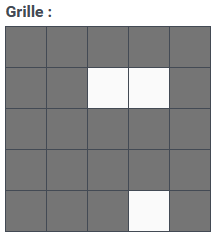
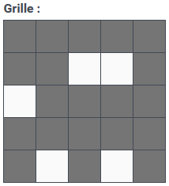
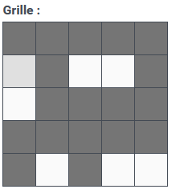

## [HV23.03] Santa's grille (brp64)
### Description
>#### Introduction
>While contemplating the grille and turning some burgers, Santa decided to send all the hackers worldwide some season's greetings.  
>

>#### Image illustration
>This image is only for illustration purposes. Solve the challenge using the image above in the introduction section.  
>
>

### Solution
After reverse image searching the example image, references to grille encryption came up which seem to match the challenge quite well.
But to decrypt the text we need a grille we don't have. We're in luck as this cipher as many other simple ciphers is vulnerable to a [know-plain-text](https://en.wikipedia.org/wiki/Known-plaintext_attack) attack. Due to the way the cipher works, we can deduce that the Flag will be 4x a 6 character long string. The first 5 of 6 characters will have to be ```HV23{``` from this we can already definitifly find 3 holes.  
  
  
The other 2 of the 5 character are a bit more difficult because the have more that one obvious possibilities. But upon further inspections we can find that these holes also only have one valide position.  
  
  
The last hole can be found by rotating the grille 3 times and looking where ```}``` lands.  

  
With this grille we can nou use a tool like [Grille Cipher (Cardan Grille)](https://merri.cx/enigmator/cipher/grille.html) to decrypt the flag. Sadly as it turns out the tool rotates the grille the wrong way which results in ```HV23{mt2023}8ckven3rry_h```. Rearanged we get **```HV23{m3rry_h8ckvent2023}```**.
### Adendum
If you're lazy like me you can also just bruteforce the grille with the included *solveDay3.py*