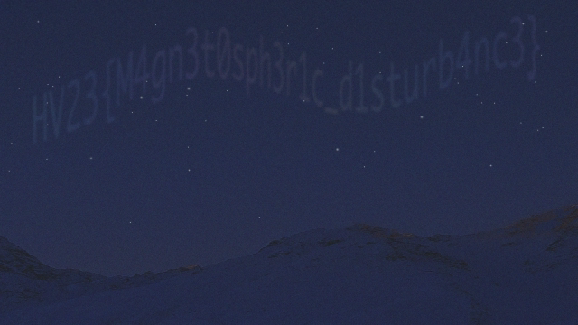

## [HV23.05] Aurora (monkey9508)
### Description
>The Northern Lights appeared at exceptionally low latitudes this year due to the high level of solar activity. But from Santa's grotto at the North Pole, it's not unusual at all to see them stretching across the sky. Snowball the elf tried to capture a video of the aurora for his Instagram feed, but his phone doesn't work well in poor light, and the results were rather grainy and disappointing. Is there anything you can do to obtain a clearer image?
### Solution
When looking closely at the given noise, there are some lighter spots which might be the flag. To remove the noise we can average all frames of the video.
```python
import cv2, numpy as np
vidcap = cv2.VideoCapture('aurora.mp4')
success,image = vidcap.read()
count = 0
success = True
image = np.float64(image)
while success:
  success,img = vidcap.read()
  if img is None:
    break
  image += np.float64(img)
  count += 1
image /= float(count)
cv2.imwrite('flag.png', np.uint8(image))
```


Flag: **Flag: HV23{M4gn3t0sph3r1c_d1sturb4nc3}**