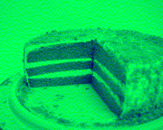

## [HV23.11] Santa's Pie (coderion)
### Description
> Santa baked you a pie with hidden ingredients!   

### Solution
In typical coderion fasion, this challenge also contained a lot or rickrolls. When looking at the red channel the the values looked surprisingly small. When you had a closer look, you could notice that the first row of pixels where the digits of pi. When looking at the blue channel, the values looked a lot like ascii but they where a litte bit off. If you xored the values of the blue channel with the red channel and decoded the values to ascii you find a lot of ```Never gonna give you up``` and ```Never gonna let you down```. Amidst these Rick Rolls, you could find the flag.  
   
solve.py:   
```py
import cv2
from re import findall

img = cv2.imread('chall.png').tolist()

out = ''
for line in range(len(img[0])):
    out += ''.join([chr(max(min(x[line][0] ^ x[line][2], 126), 32)) for x in img])

print('Flag:', findall(r'(HV23\{\w.*?\})', out)[0])
```
Flag: **HV23{pi_1s_n0t_r4nd0m}**